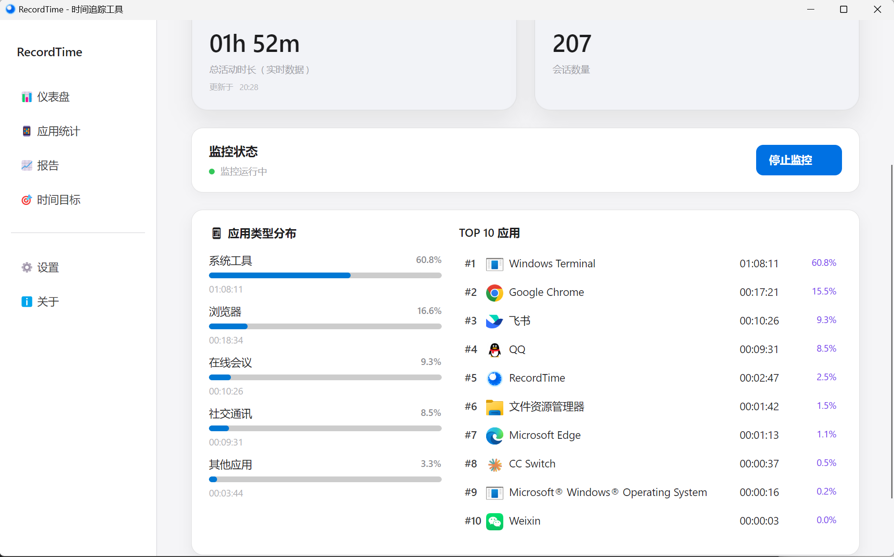
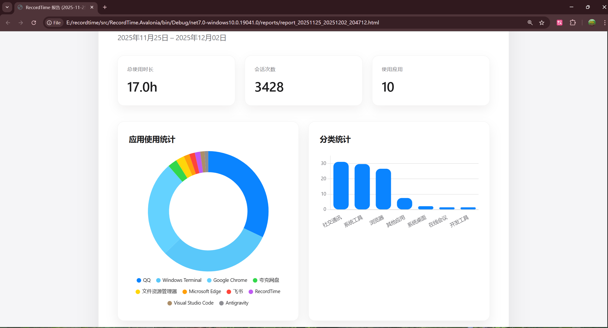
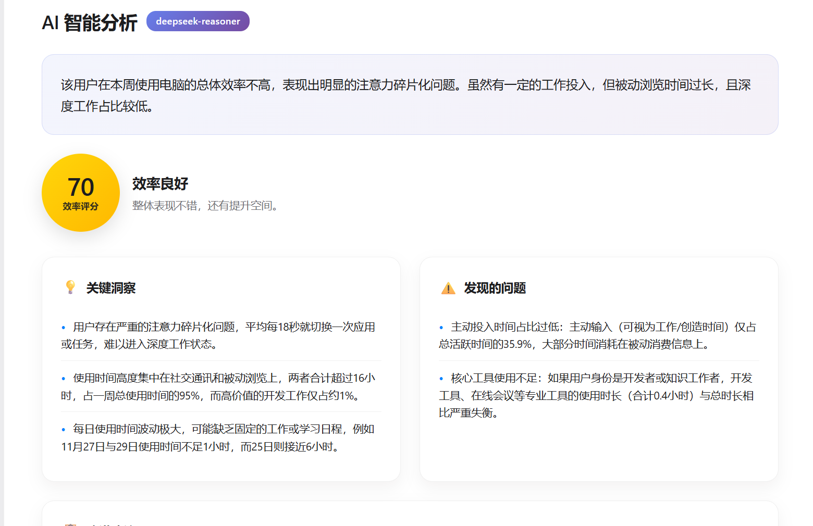
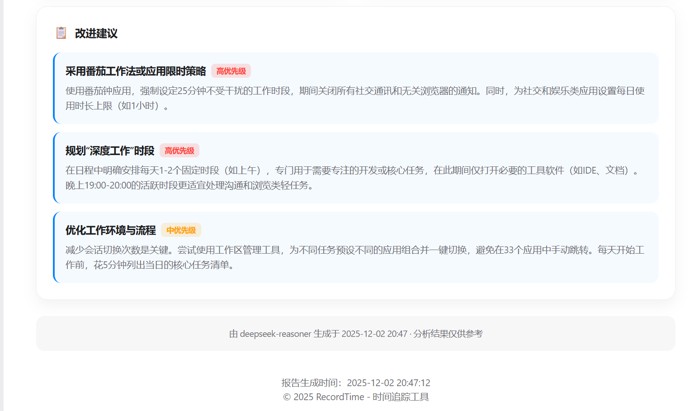

<div align="center">

# RecordTime

<!--  -->

**智能桌面应用时间追踪器** - 了解你的时间都去哪了

[](LICENSE)
[](https://dotnet.microsoft.com/)
[](https://www.microsoft.com/windows)
[](https://github.com/axiaoge2/recordtime)
[](https://github.com/axiaoge2/recordtime/releases)

[English](README.en.md) | **中文**

</div>

---

## 功能特性

| 功能 | 描述 |
|------|------|
| **自动追踪** | 每 500ms 监控活动窗口，无需手动操作 |
| **活动识别** | 智能识别视频、游戏、输入、浏览、空闲 5 种状态 |
| **时间预算** | 设定应用/分类使用目标，获得智能提醒和日末总结 |
| **可视化分析** | TOP应用排行、使用时长统计、HTML报告生成 |
| **AI 智能分析** | 支持 OpenAI API，生成个性化时间管理建议 |
| **隐私优先** | 数据本地存储，窗口标题 SHA256 加密，无云上传 |
| **多语言** | 支持中文和英文界面实时切换 |
| **系统托盘** | 后台运行、开机自启动、托盘快捷操作 |

## 截图预览

<div align="center">

### 主仪表盘

*实时追踪应用使用情况，TOP 10 应用排行，分类时长分布*

### 数据分析



*HTML报告生成、AI分析、自定义日期范围*

</div>

## 快速开始

### 方式一：下载安装包

从 [Releases](https://github.com/axiaoge2/recordtime/releases) 下载最新版本

### 方式二：从源码构建

```bash
# 克隆项目
git clone https://github.com/axiaoge2/recordtime.git
cd recordtime

# 还原依赖
dotnet restore

# 编译运行
dotnet build
dotnet run --project src/RecordTime.Avalonia
```

### 方式三：发布独立程序

```bash
# 发布单文件自包含程序 (无需安装 .NET Runtime)
dotnet publish src/RecordTime.Avalonia -c Release -r win-x64 --self-contained true
```

## 系统要求

| 项目 | 要求 |
|------|------|
| **操作系统** | Windows 10 Build 17763+ / Windows 11 |
| **运行时** | .NET 7.0 Runtime（自包含版本无需） |
| **内存** | 最少 512MB RAM |
| **磁盘** | 100MB 可用空间 |

## 技术栈

| 类别 | 技术 |
|------|------|
| **框架** | .NET 7.0 + Avalonia UI 11.x |
| **数据库** | SQLite + Entity Framework Core 7.0 |
| **图表** | LiveChartsCore.SkiaSharp 2.0 |
| **架构** | MVVM (CommunityToolkit.Mvvm) |
| **日志** | Serilog (Console + File) |

## 核心功能详解

### 活动类型识别

基于优先级的智能检测规则：

1. **空闲 (Idle)** - 系统空闲 > 5 分钟
2. **视频 (Video)** - 媒体会话播放 / 视频应用 + 音频
3. **游戏 (Gaming)** - 全屏 + 频繁输入 / 游戏平台进程
4. **主动输入 (ActiveTyping)** - 键盘 > 20次/30s 或 键盘+鼠标组合
5. **被动浏览 (PassiveBrowsing)** - 窗口聚焦但低活动量

### 时间预算系统

- **应用预算** - 为特定应用设置每日使用上限/下限
- **分类预算** - 按类别（开发工具、视频娱乐等）设置目标
- **智能提醒** - 达到阈值时发送通知提醒
- **日末总结** - 每日自动生成使用报告
- **AI 建议** - 基于历史数据智能推荐时间目标

### 数据完整性

- **心跳机制** - 每 30 秒更新会话心跳，防止崩溃导致数据丢失
- **自动修复** - 启动时检测并修复未正常结束的会话
- **数据库索引** - 优化查询性能

## 隐私保护

RecordTime 将隐私保护作为核心设计原则：

- **本地存储** - 所有数据存储在 `%LOCALAPPDATA%\RecordTime\`
- **标题加密** - 窗口标题使用 SHA256 哈希存储
- **无云同步** - 默认不上传任何数据到云端
- **AI 可选** - AI 分析功能默认关闭，完全由用户控制
- **数据脱敏** - AI 分析前自动移除 URL、邮箱等敏感信息
- **透明日志** - 详细日志便于审计 (`%LOCALAPPDATA%\RecordTime\Logs\`)

## 开发路线图

### Phase 1 - 数据完整性 ✅
- [x] 心跳机制防止数据丢失
- [x] 启动时自动修复异常会话
- [x] 数据库索引优化

### Phase 2 - 系统托盘 ✅
- [x] 系统托盘集成
- [x] 最小化到托盘 / 开机自启动
- [x] 应用图标提取

### Phase 3 - UI/分析增强 ✅
- [x] 实时监控仪表盘
- [x] HTML 报告生成
- [x] AI 分析功能
- [x] 多语言支持 (中/英)

### Phase 4 - 时间预算系统 ✅
- [x] 使用时长目标设定
- [x] 接近限制时通知提醒
- [x] 日末总结通知
- [x] AI 智能目标建议
- [x] 自定义日期范围过滤

### Phase 5 - 高级功能 (规划中)
- [ ] 图表可视化 (趋势图、饼图)
- [ ] 专注模式
- [ ] 周/月对比分析
- [ ] 数据导出 (CSV/Excel)
- [ ] PDF 报告生成

## 项目结构

```
RecordTime/
├── src/
│   ├── RecordTime.Avalonia/    # Avalonia UI 前端
│   │   ├── Views/              # 页面视图
│   │   ├── ViewModels/         # MVVM 视图模型
│   │   ├── Services/           # UI 服务
│   │   └── Resources/          # 多语言资源
│   ├── RecordTime.Core/        # 核心业务逻辑
│   │   ├── Models/             # 数据模型
│   │   └── Services/           # 监控服务
│   └── RecordTime.Data/        # 数据访问层
│       ├── Repositories/       # 数据仓储
│       └── Migrations/         # EF Core 迁移
├── tools/                      # 验证和调试工具
└── docs/                       # 文档
```

详细架构设计请参阅 [docs/ARCHITECTURE.md](docs/ARCHITECTURE.md)

## 贡献指南

欢迎提交 Issue 和 Pull Request！

### 开发环境设置

```bash
# 克隆仓库
git clone https://github.com/axiaoge2/recordtime.git
cd recordtime

# 还原依赖并构建
dotnet restore
dotnet build

# 运行测试
dotnet test

# 运行应用
dotnet run --project src/RecordTime.Avalonia
```

### 代码规范

- 遵循 [Microsoft C# 编码规范](https://docs.microsoft.com/en-us/dotnet/csharp/fundamentals/coding-style/coding-conventions)
- 提交信息格式：`feat:`, `fix:`, `docs:`, `refactor:`
- 提交前运行 `dotnet format` 格式化代码

详见 [CONTRIBUTING.md](CONTRIBUTING.md)

## 相关文档

| 文档 | 描述 |
|------|------|
| [ARCHITECTURE.md](docs/ARCHITECTURE.md) | 详细技术架构设计 |
| [CONTRIBUTING.md](CONTRIBUTING.md) | 贡献指南 |
| [CHANGELOG.md](CHANGELOG.md) | 版本更新日志 |

## 许可证

本项目采用 [MIT License](LICENSE) 开源协议。

## 致谢

- [Avalonia UI](https://avaloniaui.net/) - 跨平台 .NET UI 框架
- [LiveCharts2](https://lvcharts.com/) - 数据可视化图表库
- [CommunityToolkit.Mvvm](https://github.com/CommunityToolkit/dotnet) - MVVM 工具包
- 灵感来源：[ActivityWatch](https://activitywatch.net/)、RescueTime

---

<div align="center">

**如果这个项目对你有帮助，欢迎 Star 支持！**

[](https://star-history.com/#axiaoge2/recordtime&Date)

</div>
